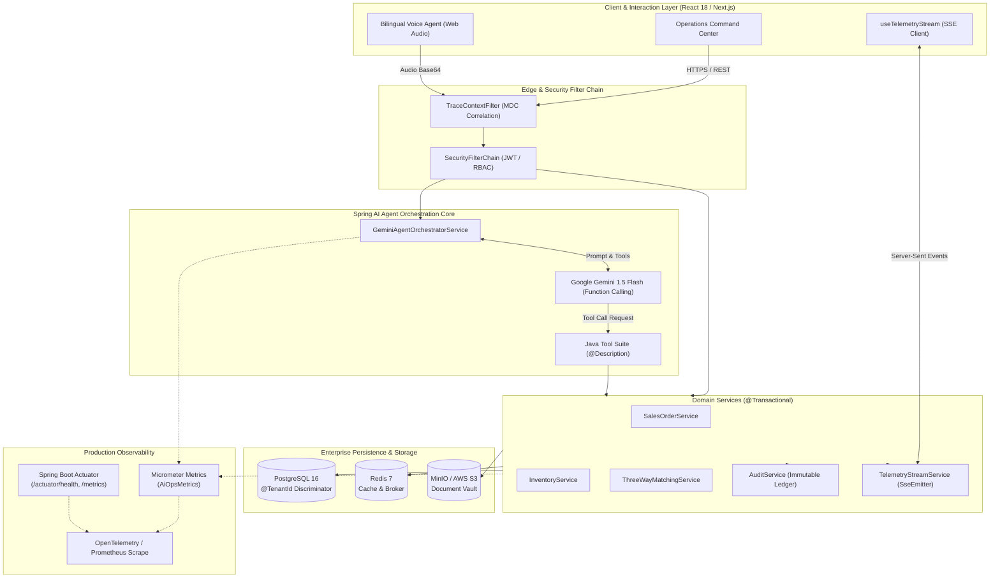

<div align="center">

# AIOps India (ऐऑप्स भारत)

### Autonomous Operational Intelligence, SLA Forecasting & Financial Guardrails for Indian Supply Chains & Multi-Hub Logistics

[](https://openjdk.org/projects/jdk/21/)
[](https://spring.io/projects/spring-boot)
[](https://spring.io/projects/spring-ai)
[](https://react.dev/)
[](https://www.postgresql.org/)
[](https://www.docker.com/)
[](https://opensource.org/licenses/Apache-2.0)
[-brightgreen?style=for-the-badge)](https://github.com/aiops-india/aiops-enterprise)

<p align="center">
  <a href="#executive-overview">Executive Overview</a> •
  <a href="#key-capabilities--subsystems">Key Capabilities</a> •
  <a href="#system-architecture">System Architecture</a> •
  <a href="#directory-layout">Directory Layout</a> •
  <a href="#local-development--quickstart">Quickstart</a> •
  <a href="#security--multi-tenancy-model">Security & Tenancy</a> •
  <a href="#observability--telemetry">Observability</a>
</p>

</div>

---

## Executive Overview

### The Core Problem
Mid-market manufacturers, distributors, and 3PL providers across India operate in high-friction environments characterized by fragmented ERPs (Tally, Busy, SAP, custom SQL databases), distributed logistics corridors (Bhiwandi Central, JNPT Port, Pune Hadapsar, Taloja, Ahmedabad), and strict compliance regimes (GST e-Invoicing, E-Way Bill lifecycle validation).

Annually, mid-market enterprises hemorrhage **3.5% to 5.2% of EBITDA** due to:
1. **Transit Dispatch Delays:** Unmonitored safety stock depletion and supplier OTIF (On-Time In-Full) breaches causing cascade fulfillment delays across Maharashtra and Gujarat industrial belts.
2. **Working Capital Entrapment:** Delayed cash collection cycles from unverified 3-way invoice mismatches (Purchase Order $\leftrightarrow$ Goods Receipt Note $\leftrightarrow$ Vendor Tax Invoice).
3. **Manual Compliance Overhead:** Reconciling line-item HSN codes, CGST/SGST/IGST tax splits, and E-Way bill expiry timers across hundreds of PDF scans daily.

### The Solution: Dual-Engine Autonomous Platform
**AIOps India** is an institutional-grade operations command platform designed to automate operational synthesis and remediation. It couples a **high-throughput Java 21 / Spring Boot transactional core** with **Google Gemini Flash multimodal agentic function calling**, governed by strict **deterministic Human-in-the-Loop (HITL) financial guardrails**.

```
┌─────────────────────────────────────────────────────────────────────────────┐
│                       AIOPS INDIA DUAL-ENGINE MATRIX                        │
├──────────────────────────────────────┬──────────────────────────────────────┤
│  ⚡ Deterministic Transaction Core   │  🧠 Autonomous Agentic Intelligence  │
├──────────────────────────────────────┼──────────────────────────────────────┤
│ • Strict Multi-Tenant Schema Filters │ • Natural Language Supply Chain Q&A  │
│ • Sub-millisecond Order State Engine │ • Multi-hop Cross-System Diagnostics │
│ • Automated 3-Way Reconciliation     │ • Multimodal Invoice / LR OCR Engine │
│ • Immutable Audit Event Ledger       │ • Grounded Evidence Provenance Tracing│
│ • Real-Time Server-Sent Events (SSE) │ • Autonomous Action Proposals & HITL │
└──────────────────────────────────────┴──────────────────────────────────────┘
```

---

## Key Capabilities & Subsystems

### 1. Autonomous Operations Command Center
- **Real-Time Telemetry Stream (`/api/v1/telemetry/stream`):** Low-latency Server-Sent Events (SSE) broadcasting real-time `StockBreachEvent`, `JobStatusUpdatedEvent`, and `NewAttentionItemEvent` without polling.
- **Dynamic Days of Cover (DoC) Telemetry:** Proactively forecasts inventory depletion horizons across warehouse hubs, factoring in historical velocity and supplier lead-time variance.

### 2. Deterministic Agent Orchestration (Spring AI)
- **Strictly Typed Tool Execution:** Gemini Flash is bound to strongly typed Java services via Spring AI's function-calling abstraction (`CheckStockTool`, `ExpediteDispatchTool`, `TriggerVendorReminderTool`, `RebalanceWarehouseStockTool`).
- **Zero Hallucination Grounding:** Agents cannot execute unvetted database modifications; all proposals must validate against Jakarta Bean Validation constraints and active domain rules.

### 3. Auditable Evidence Records & Grounded Citations
- Every insight presented by the agent contains an **Auditable Evidence Record** linking directly to underlying ERP ledger transactions, voucher numbers, and warehouse bin IDs.
- Operators can inspect the full reasoning timeline, tool invocation metadata, and confidence metrics in an embedded slide-out drawer.

### 4. Automated Multimodal Document Intelligence & 3-Way Matching
- **Gemini Multimodal OCR:** Extracts line items, HSN/SAC codes, GSTINs, and tax distributions from uploaded PDF/image invoices and Lorry Receipts (LR).
- **Automated 3-Way Reconciliation:** Automatically matches Tax Invoices against Purchase Orders and Goods Receipt Notes (GRN), flagging quantity differences, unit-price discrepancies, and tax miscalculations before ledger posting.

### 5. Financial Guardrails & Human-in-the-Loop (HITL) Autonomy
- Configurable autonomous authorization policies:
  - **Tier 1 (Low Risk - Auto Approved):** Expedite customer notifications, recalculate safety stock, or re-run reconciliation.
  - **Tier 2 (Medium Risk - Manager Sign-off):** Inter-warehouse stock transfers $< ₹50,000$, automated vendor PO generation $< ₹25,000$.
  - **Tier 3 (High Risk - Dual Approval):** Commercial credit adjustments, high-value supplier POs, or customer credit-limit overrides.

### 6. Native India-First Enterprise Localization
- **GSTIN & E-Way Bill Validation:** Automated regex and checksum verification for 15-character Indian GSTINs (`27AABCS1429B1Z2`).
- **Indian Numbering Format:** Tabular formatting enforcing Lakhs and Crores via `Intl.NumberFormat('en-IN')` (e.g., `₹18,45,000.00`).
- **Bilingual Voice Agent:** Native conversational support for English (India), Hindi (हिन्दी), and Hinglish operational queries.

---

## System Architecture



---

## Directory Layout & Codebase Structure

```text
aiops-india/
├── .github/                         # GitHub Actions CI/CD workflows & issue templates
├── backend/                         # Spring Boot 3.3.x (Java 21) Microservice
│   ├── src/main/java/com/aiops/
│   │   ├── agent/                   # Spring AI Gemini orchestrator, tools, and prompts
│   │   │   ├── GeminiAgentOrchestratorService.java
│   │   │   ├── SpringAiAgentService.java
│   │   │   └── tools/               # Spring AI executable Java tools
│   │   ├── config/                  # Security, Observability, Multi-Tenancy & Async configs
│   │   │   ├── SecurityConfig.java
│   │   │   ├── ObservabilityConfig.java
│   │   │   └── AsyncDocumentProcessingConfig.java
│   │   ├── controller/              # REST & SSE API Controllers
│   │   ├── entity/                  # JPA Entities with @TenantId isolation
│   │   ├── interceptor/             # TraceContextFilter & MDC Correlation Handlers
│   │   ├── repository/              # Spring Data JPA Repositories
│   │   ├── service/                 # Transactional Domain Services
│   │   │   ├── ThreeWayMatchingService.java
│   │   │   ├── AuditService.java
│   │   │   └── DocumentOcrService.java
│   │   ├── storage/                 # S3-Compatible SigV4 Object Storage Client
│   │   └── telemetry/               # Metrics & SSE Real-time Streaming
│   │       ├── controller/TelemetryController.java
│   │       ├── metrics/AiOpsMetrics.java
│   │       └── service/TelemetryStreamService.java
│   └── pom.xml                      # Maven project specification (50 Unit/Integration Tests)
├── frontend/                        # Next.js 14 / React 18 / TypeScript SPA
│   ├── src/
│   │   ├── api/                     # Type-safe REST client & API bindings
│   │   ├── components/
│   │   │   ├── agent/               # AI Assistant drawer, timeline & citations
│   │   │   ├── layout/              # Persistent AppLayout, Sidebar & Header
│   │   │   └── ui/                  # PageSkeletonLoader, CommandPalette, Badges
│   │   ├── contexts/                # Auth, Theme, Agent & RouteTransition contexts
│   │   ├── hooks/                   # useTelemetryStream, useRouteTransition, useVoice
│   │   ├── pages/                   # Lazy-loaded enterprise command views
│   │   │   ├── DashboardPage.tsx
│   │   │   ├── OrdersPage.tsx
│   │   │   ├── InventoryPage.tsx
│   │   │   ├── InvoicesPage.tsx
│   │   │   └── AttentionPage.tsx
│   │   └── utils/                   # Indian currency, date & GST formatters
│   ├── tailwind.config.js           # Cinematic slate theme tokens & animations
│   └── package.json                 # React 18, TanStack Query, Lucide icons
├── docker/                          # Dockerfiles for backend and frontend builds
├── k8s/                             # Kubernetes manifests (Deployments, Services, ConfigMaps)
├── docker-compose.yml               # Multi-container orchestration (Postgres, Redis, MinIO)
├── .env.example                     # Environment template with mock credentials
└── README.md                        # Master institutional documentation
```

---

## Local Development & Quickstart

### Prerequisites
- **Java Development Kit (JDK):** Version 21 or higher
- **Node.js & npm:** Node.js v20.x+ and npm v10.x+
- **Docker & Docker Compose:** Docker Desktop 4.x+

### 1. Clone & Configure Environment
```bash
git clone https://github.com/your-org/aiops-india.git
cd aiops-india

# Copy environment template
cp .env.example .env
```

### 2. Launch Local Infrastructure (PostgreSQL, Redis, MinIO)
```bash
docker-compose up -d postgres redis minio
```
- **PostgreSQL 16:** `localhost:5432` (`aiops_user` / `aiops_secure_password_2026`)
- **Redis 7:** `localhost:6379`
- **MinIO Console:** `http://localhost:9001` (`aiops-minio-admin` / `aiops-minio-secret-32chars`)

### 3. Start Backend Service (Spring Boot)
```bash
cd backend

# Run with local development profile (H2 in-memory or Docker Postgres)
./mvnw spring-boot:run -Dspring-boot.run.profiles=dev
```
*The backend starts at `http://localhost:8080`. All 50 unit and integration tests can be verified using `./mvnw test`.*

### 4. Start Frontend Command Center (React / Vite)
```bash
cd ../frontend

# Install dependencies and launch Vite development server
npm install
npm run dev
```
*Open `http://localhost:5173` (or `http://localhost:3000`) in your browser to access the Command Center.*

---

## Security, Multi-Tenancy & Compliance Model

### Tenant Isolation Architecture
Every database entity implements the `@TenantId` discriminator pattern. Requests authenticate via signed JWT tokens carrying the `organizationId` claim:
```java
@Entity
@Table(name = "sales_orders")
public class SalesOrder {
    @Id
    private String id;

    @TenantId
    @Column(name = "tenant_id", nullable = false, updatable = false)
    private String tenantId;

    @Column(name = "order_number", nullable = false)
    private String orderNumber;
    ...
}
```
Hibernate automatically injects `WHERE tenant_id = :currentTenant` into every SQL statement generated across the session, preventing cross-tenant data leakage.

### Role-Based Access Control (RBAC)
| Role | Permissions | Autonomous Execution Boundaries |
| :--- | :--- | :--- |
| `OPERATIONS_VIEWER` | Read-only dashboards and telemetry | View attention feed, inspect citations |
| `OPERATIONS_DISPATCHER` | Order status updates & stock queries | Trigger dispatch alerts, auto-approve POs $< ₹25,000$ |
| `OPERATIONS_MANAGER` | Financial overrides & vendor approval | Approve rebalances, resolve 3-way match exceptions |
| `SYSTEM_ADMIN` | Organization policy & API key setup | Configure AI autonomy thresholds, view Prometheus metrics |

---

## Observability & Telemetry

### Custom Micrometer Metrics
AIOps India records domain metrics accessible via `/actuator/prometheus`:
- `aiops.gemini.flash.latency`: High-resolution `Timer` recording Gemini Flash inference latency with 50th, 95th, and 99th percentiles.
- `aiops.gemini.token.consumption`: `DistributionSummary` tracking prompt, completion, and total token usage per tenant.
- `aiops.agent.tool.invocations`: `Counter` tracking tool execution counts, failure rates, and error classifications.

### Distributed Tracing with MDC Propagation
All incoming HTTP requests, asynchronous background worker threads (`ThreadPoolTaskExecutor`), and SSE events propagate `traceId` and `spanId` through OpenTelemetry and SLF4J MDC, returning `X-Trace-Id` headers on all responses.

---

## License & Governance

This project is licensed under the **Apache License, Version 2.0**. See the [LICENSE](LICENSE) file for details.

```text
Copyright 2026 AIOps India Platform Contributors

Licensed under the Apache License, Version 2.0 (the "License");
you may not use this file except in compliance with the License.
You may obtain a copy of the License at

    http://www.apache.org/licenses/LICENSE-2.0
```
