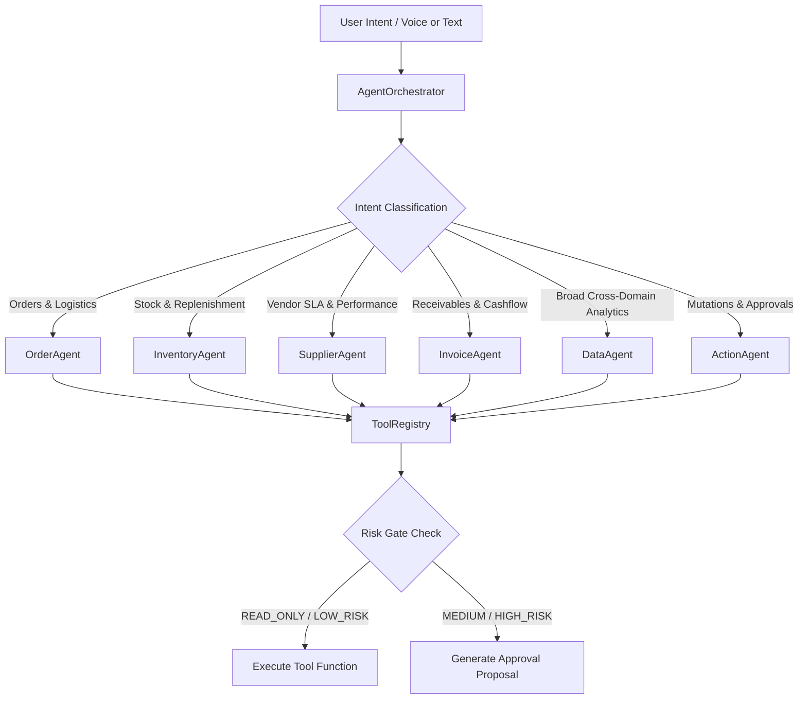

# Agent System & Specialist Subagents

## 1. Multi-Agent Orchestration Architecture

The AIOps agent layer is implemented as a **Coordinated Multi-Agent Specialist Network**. Rather than relying on a monolithic prompt that attempts to solve all operational problems at once, the central **`AgentOrchestrator`** routes intent to specialized subagents.



---

## 2. Specialist Agents Directory

### 1. `DataAgent`
- **Domain**: High-level cross-functional operational synthesis.
- **Capabilities**: Produces the morning "Attention Center" summary, synthesizes cash flow health with delivery backlog, and identifies systemic bottlenecks.
- **Primary Tool**: `AnalyticsTools.getAttentionSummary`

### 2. `OrderAgent`
- **Domain**: Sales order fulfillment, dispatch tracking, and root-cause delay diagnostics.
- **Capabilities**: Connects order status with customer history, traces missing line items back to inventory deficits, and links stock shortages to pending purchase orders.
- **Primary Tools**: `OrderTools.getOrderDetails`, `OrderTools.investigateDelay`, `OrderTools.listDelayedOrders`

### 3. `InventoryAgent`
- **Domain**: Stock balancing, stockout prediction, and days-of-supply modeling.
- **Capabilities**: Computes average daily run-rate per SKU, calculates days-of-cover remaining, and flags critical items requiring urgent reorders.
- **Primary Tools**: `InventoryTools.checkStock`, `InventoryTools.getLowStockForecast`, `InventoryTools.reorderRecommendation`

### 4. `SupplierAgent`
- **Domain**: Vendor scorecards, purchase order tracking, and lead-time variability.
- **Capabilities**: Analyzes supplier On-Time In-Full (OTIF) rates, flags persistent dispatch slippage, and recommends alternative verified vendors.
- **Primary Tools**: `SupplierTools.benchmarkReliability`, `SupplierTools.getOpenPurchaseOrders`, `SupplierTools.getSupplierScorecard`

### 5. `InvoiceAgent`
- **Domain**: Accounts receivable, GST invoice aging, and payment risk.
- **Capabilities**: Filters overdue balances by aging buckets (30/60/90+ days), computes total exposure per dealer, and crafts automated dunning communication.
- **Primary Tools**: `InvoiceTools.getOverdueInvoices`, `InvoiceTools.getAgingAnalysis`, `InvoiceTools.preparePaymentReminder`

### 6. `ActionAgent`
- **Domain**: Human-in-the-Loop operational execution.
- **Capabilities**: Drafts purchase orders, initiates stock transfer proposals between Bhiwandi and Pune warehouses, and queues dispatch reminders.
- **Primary Tools**: `ActionTools.proposePurchaseOrder`, `ActionTools.proposeStockTransfer`, `ActionTools.scheduleNotification`

---

## 3. Tool Definition & Risk Governance

All tools are registered in the `ToolRegistry` and decorated with metadata including:
- **`name`**: Unique identifier (e.g., `inventory.getLowStockForecast`)
- **`description`**: Semantic documentation of tool capability
- **`riskLevel`**: Classification into `READ_ONLY`, `LOW_RISK`, `MEDIUM_RISK`, or `HIGH_RISK`
- **`requiresApproval`**: Boolean flag forcing human sign-off before invocation

```java
@ToolDefinition(
    name = "action.proposePurchaseOrder",
    description = "Proposes a new Purchase Order to an approved supplier for stock replenishment",
    riskLevel = RiskLevel.HIGH_RISK,
    requiresApproval = true
)
public ToolExecutionResult proposePurchaseOrder(Map<String, Object> params) { ... }
```

### Risk Level Matrix

| Risk Level | Mutation Type | Auto-Executable? | Audit Log Required? | Example Tools |
|---|---|---|---|---|
| `READ_ONLY` | None (Query Only) | Yes (Immediate) | Yes (Debug/Trace) | `order.investigateDelay`, `inventory.checkStock` |
| `LOW_RISK` | Non-financial Notification | Yes (Immediate) | Yes | `action.scheduleNotification` |
| `MEDIUM_RISK` | Internal Warehouse Rebalancing | Requires Confirmation | Yes | `action.proposeStockTransfer` |
| `HIGH_RISK` | Financial Procurement / Status Change | **Requires Formal Approval** | Yes (Immutable) | `action.proposePurchaseOrder`, `invoice.releasePayment` |

---

## 4. Citation & Evidence Verification

Every assertion made by the agent must cite structured domain records to prevent hallucination:

```json
{
  "citations": [
    {
      "sourceType": "SALES_ORDER",
      "referenceId": "ORD-1042",
      "title": "Sales Order #ORD-1042 (Sharma Electronics)",
      "snippet": "Status: DELAYED | Value: ₹1,45,000 | Promised: Oct 1, 2026",
      "url": "/orders"
    },
    {
      "sourceType": "PURCHASE_ORDER",
      "referenceId": "PO-2381",
      "title": "Purchase Order #PO-2381 (Polycab Wires Ltd)",
      "snippet": "Status: DELAYED | Revised Dispatch: Oct 4, 2026",
      "url": "/suppliers"
    }
  ]
}
```

The frontend visualizes citations as clickable badges that allow operations managers to directly inspect underlying records.

---

## 5. Voice Intelligence & Multilingual Pipeline

AIOps India provides a voice-first operational experience designed for warehouse managers on the move:

1. **Speech-to-Text (STT)**: Uses Web Speech API with browser-native speech recognition configured for `en-IN` (Indian English) and `hi-IN` (Hindi / Hinglish).
2. **Intent Parsing**: Agent orchestrator parses Hindi terms (e.g., *"order delay kyu hai"*, *"kitna stock bacha hai"*) seamlessly into structured tool parameters.
3. **Text-to-Speech (TTS)**: Synthesizes concise natural audio responses using `SpeechSynthesisUtterance` with pitch and rate tailored for operational clarity.
