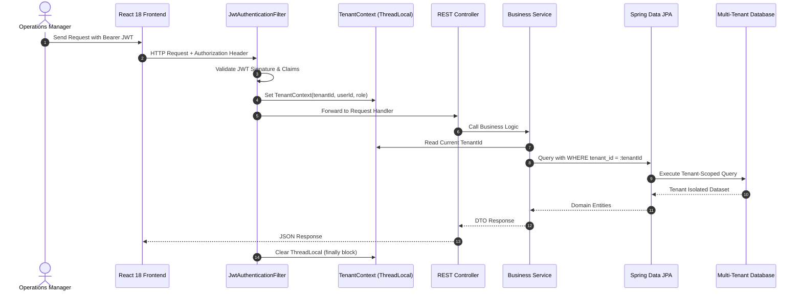
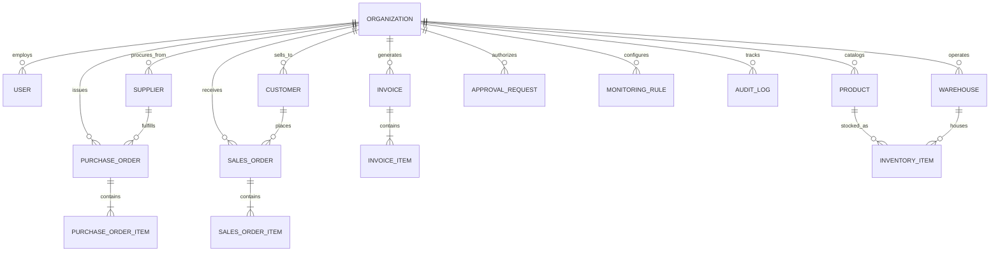

# System Architecture & Technical Specifications

## 1. Architectural Philosophy

AIOps India is designed as an **Autonomous Enterprise Nervous System** tailored to the operational realities of Indian mid-market businesses. 

Unlike generic "chat-with-data" wrappers or fragile text-to-SQL utilities, AIOps India adopts a **Tool-Mediated Agentic Architecture** governed by three non-negotiable architectural invariants:

1. **Zero Raw SQL Execution**: The agent never generates or executes unstructured SQL queries. All interactions with enterprise databases occur through audited, strongly typed Java tools.
2. **Strict Multi-Tenant Isolation**: Tenant boundaries are enforced at the transport and thread level via `TenantContext`. No query can access records belonging to another tenant ID.
3. **Risk-Gated State Mutation**: High-risk business actions (reordering, payments, status overrides) require formal Human-in-the-Loop approval workflows before any database change is committed.

---

## 2. Multi-Tenancy & Security Model



### Key Security Components
- **`TenantContext`**: A thread-safe `ThreadLocal<String>` wrapper that holds the authenticated tenant ID throughout the HTTP request lifecycle. Always cleared in a `finally` block to prevent thread pool contamination.
- **`JwtTokenProvider`**: Signs and parses HS256 JWT tokens containing `tenantId`, `userId`, `role`, and `sub`.
- **`JwtAuthenticationFilter`**: Intercepts all incoming requests to `/api/**`, verifies the JWT token, extracts user details, sets Spring Security's `SecurityContextHolder`, and populates `TenantContext`.
- **`SecurityConfig`**: Permits public access only to `/api/auth/**`, while requiring authentication for all operational, inventory, agent, and reporting endpoints.

---

## 3. Data Model & Entity Relationship

The domain model captures all critical operational facets of Indian distribution businesses:



### Core Entities
- **`Organization`**: Tenant root entity holding GSTIN, PAN, registered state, and industry tier.
- **`SalesOrder` & `SalesOrderItem`**: Tracks dealer orders, delivery addresses, dispatch statuses, and estimated delivery dates.
- **`PurchaseOrder` & `PurchaseOrderItem`**: Tracks vendor procurement, promised delivery dates, and receiving status.
- **`InventoryItem`**: Real-time stock levels, allocated units, available units, and safety reorder thresholds per warehouse.
- **`Invoice`**: GST tax invoices with taxable value, CGST, SGST, IGST, payment due dates, and payment status (`PAID`, `PARTIAL`, `OVERDUE`).
- **`ApprovalRequest`**: Formal proposal object containing action type, risk level, payload diff, requested by, approved by, and execution status.
- **`AuditLog`**: Immutable ledger recording timestamp, actor, tenant ID, action, target entity, and IP address.

---

## 4. Dual-Speed Agent Architecture

To provide an instantaneous conversational experience while protecting enterprise state, AIOps India implements a **Dual-Speed Pattern**:

1. **Fast-Path (Read & Diagnostics)**:
   - Tool calls with `RiskLevel.READ_ONLY` execute immediately in the request thread.
   - Summaries, correlations, and multi-hop investigations complete in < 250ms.
   - Evidence is attached to responses as structured citations (`CitationEvidence`).

2. **Gated-Path (Actions & Mutations)**:
   - Tool calls with `RiskLevel.HIGH_RISK` or `RiskLevel.MEDIUM_RISK` generate an `AgentActionProposal`.
   - If user confirmation is required, an `ApprovalRequest` is persisted in the database.
   - Execution is deferred until an authorized user approves the proposal via UI or authenticated API.

---

## 5. Deployment Topology

AIOps India supports cloud-native deployment across single-node Docker Compose or multi-node Kubernetes clusters:

```
[ Ingress Controller (Nginx) ]
        |
        +---> [ / (Frontend SPA) - Nginx / React 18 Pods ]
        |
        +---> [ /api/* & /ws - Spring Boot Backend Pods ]
                    |
                    +---> [ PostgreSQL 16 (StatefulSet) ]
                    |
                    +---> [ Redis 7 Cache & Session Pod ]
```
